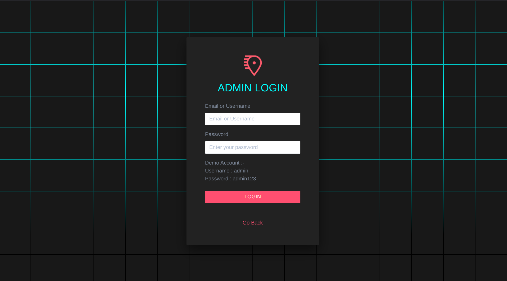
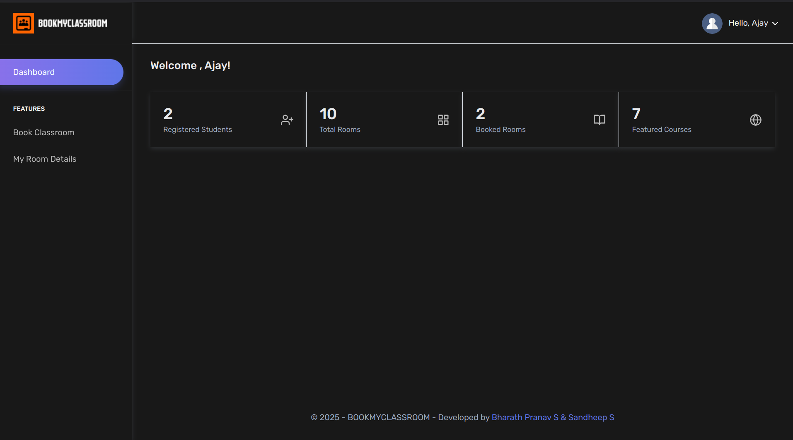
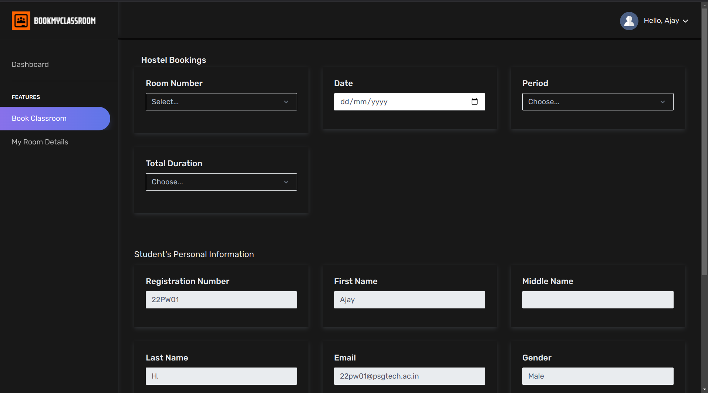

# BookMyClassroom

This is a Classroom Booking System designed to help admins manage classrooms, students, and bookings. It allows students to book available classrooms and manage their profile, while the admin can add, update, and manage rooms, students, and courses.

## Live Demo
Check out the live app [here](https://bookmyclassroom.kesug.com/).

## Installation

1. Clone the repository:
   ```bash
   git clone https://github.com/Hirata-Origami/BookMyClassroom.git
   cd BookMyClassroom
   ```

2. Copy these files and paste in htdocs

3. Run Apache and phpmyadmin in xampp

### Admin Features:
- **Dashboard:** Overview of the system.
- **Manage Students:** Add, edit, and view student profiles.
- **Manage Rooms:** Add, edit, and view classrooms.
- **Manage Courses:** Add and edit courses.
- **Booking Management:** View and manage classroom bookings.
- **Availability Check:** Check room availability for a specific date and time.
- **Statistics:** View various system stats like total students, rooms, and bookings.

### Student Features:
- **Dashboard:** Overview of the system.
- **Profile Management:** Students can view and update their profiles, including changing their passwords.
- **Classroom Booking:** Students can book available classrooms.
- **Check Availability:** Students can check if a classroom is available at a given time.
  
## Tech Stack
- **Frontend:** HTML, CSS, JavaScript
- **Backend:** PHP
- **Database:** MySQL

### Configuration:
- Update the database credentials in `includes/config.php` to match your MySQL configuration.

## Example Images

### Login


### Dashboard


### Add Room


## Contributing

Contributions are welcome! Please feel free to submit a pull request or open an issue.

## Contact

For any inquiries, feel free to reach out:
- Author: Bharath Pranav
- Email: bharathpranav91@gmail.com
- Live Demo: [here](https://bookmyclassroom.kesug.com/)
